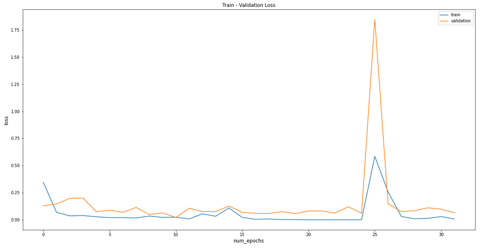
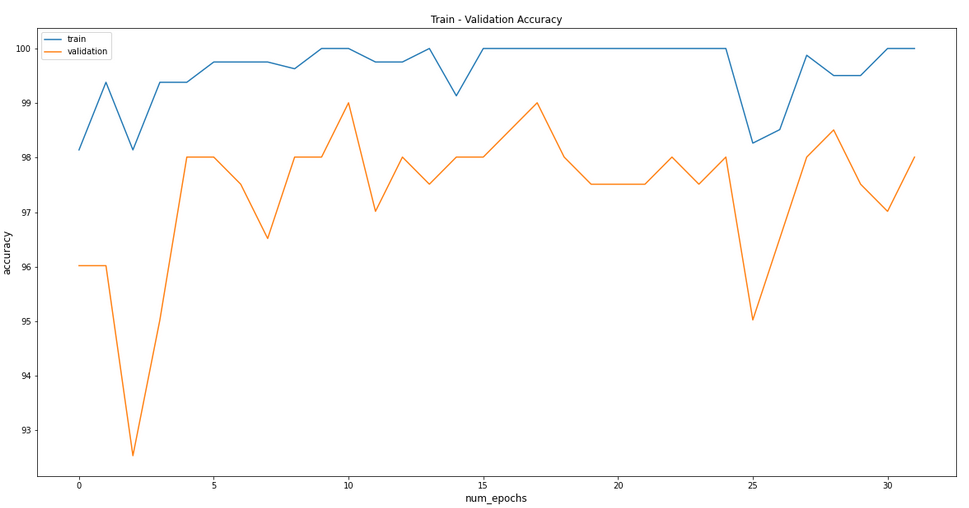

# Day-Night Classifier 

The model is built in **pytorch** Deployed as a **REST API** using **Flask** 

## Dependencies 
```
pip install -r requirements.txt 
```

## Dataset Collection

Scraped 1200+ samples for model training, validation & testing using `selenium` which then filterd to 1200 samples 

Dataset is collected for **13** different countries from Europe, USA & Australia

## Inputs

Input data are resized, normalized accross the RGB channels & transformed to pytorch tensors:
```python
transforms.Compose([
    transforms.Resize((224,224)),
    transforms.ToTensor(),
    transforms.Normalize((0.5, 0.5, 0.5), (0.5, 0.5, 0.5))])
```

## Model Training

Model is finetuned on **resnet-101** with **Adam** optimizer and hyperparameters:
```python
batch_size = 32
n_epochs = 16
learning_rate = 0.0001
betas = (0.9, 0.999)
```

## Model Outputs

### Train-Val Loss




### Train-Val Accuracy

 <br>


[](https://colab.research.google.com/drive/1UYwYAH1jHbZKKZvW-jZug6-A4fI0Aywy)


<a href="https://drive.google.com/drive/folders/1dcfz1sulyhUuEo7Pbtfk0h6-fspvT5Zj?usp=sharing"> Download Dataset & Model Weights</a>

